# Taller práctico de Copilot 365 - Guía de Laboratorios

## Práctica 1: Creación de una presentación con apoyo de Copilot

**Duración:** 15 minutos

## Descripción General

En este laboratorio, aprenderás a utilizar Microsoft 365 Copilot en PowerPoint para crear presentaciones profesionales usando documentos y desde cero, con secciones, estilos e imagenes, tomando como caso el Programa de Educación Financiera Digital de BancoEstado.

## Objetivos de Aprendizaje

Al completar este laboratorio, serás capaz de:

- Generar presentaciones profesionales usando Copilot empleando un documento como input.
- Generar presentaciones profesionales usando Copilot desde cero, usando un prompt como input.
- Usar Copilot para crear secciones, slides, aplicar estilos.

## Prerrequisitos

### Conocimientos Requeridos

- Conocimiento básico de Microsoft Power Point para crear presentaciones

## Instrucciones Paso a Paso

En estos ejercicios se emplearán una serie de documentos base, que estarán disponibles en el One Drive de su maquina virtual de practicas.

Los documentos a disposición son los siguientes:

- **Informe_Avance_Programa_Educacion_Financiera_Digital_BancoEstado.docx**, de 2pp

### Ejercicio 1: Crear presentación a partir de un documento existente

**Objetivo:** Usar Copilot para crear una presentación a partir de un documento Word existente.

**Instrucciones:**

1. Abre **Power Point**.

2. En la parte superior aparece una sección que dice **¿Qué le gustaría crear hoy?**

  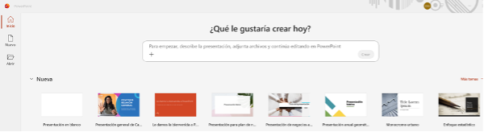

3. En el cuadro de texto, completa lo siguiente y luego haz clic en **Crear**:
 ```
Crea una presentación acerca de `/Informe_Avance_Programa_Educacion_Financiera_Digital_BancoEstado.docx`. Cada slide debe tener como máximo 4 bullets. Mantén un tono profesional e institucional, orientado a un comité interno de BancoEstado. 
```
4. Define el estilo visual para la presentación y luego haz clic en **Confirmar** (imagen referencial).
 
   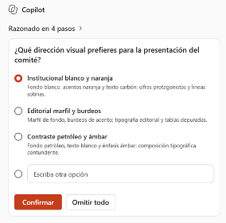

Se irán mostrando los pasos que sigue la IA para la generación de la presentación.
Al final se mostrará un mensaje indicando cómo se ha creado la presentación: número de slides, tono, contenido, etc.

5. Aplica el siguiente prompt:
```
Cambia el tono de la diapositiva 7 para que sea más didáctico.
```
Verifica que el contenido del slide 7 se haya modificado para que sea más claro y entendible.

6. Aplica el siguiente prompt:
```  
Cambia el tono de la diapositiva 8 para que sea más persuasivo. 
```
Verifica que el contenido del slide 7 se haya modificado para que sea mas claro y entendible.

7. Aplica el siguiente prompt:

  ``` 
  Agregar al final 2 slides sobre los próximos hitos del programa para el segundo semestre de 2026, cita la fuente de información que uses. 
  ```
 Si Copilot pregunta de dónde sacar la información, se puede seleccionar **Usar la presentación actual** y **Confirmar**.

   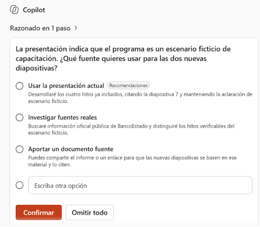
   
Confirmar que se crean las 2 diapositivas adicionales de manera correcta.

8. Selecciona las 2 diapositivas recientemente generadas, luego aplica este prompt:

  ``` 
  Rediseña las diapositivas con un estilo ejecutivo y minimalista, conservando el contenido, los datos y las citas.
  ``` 
  
   Si Copilot pide confirmación, reconfirma que solo debe aplicar lo solicitado para esos slides seleccionados, luego **Confirmar**.

   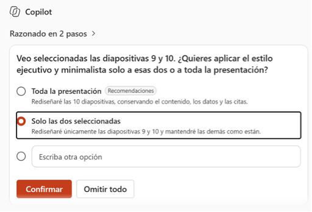

9. Selecciona una Preferencia de imagen: **Imágenes de archivo**.

10. Con la presentación generada, crearemos un nuevo slide con Copilot. En la pestaña Inicio selecciona **Nueva diapositiva con Copilot**.

11. Escribe el siguiente prompt:
``` 
Agregar una diapositiva acerca de los riesgos y dependencias identificados para la ejecución del programa.
``` 
12. Ubícate en el primer slide de la presentación e indica el siguiente prompt:
``` 
Solo para este slide aplica un estilo gráfico diferente, de slide de portada, con una combinación de colores llamativa, pero corporativa, y una letra moderna y fácil de leer.
``` 

13. Manteniéndote todavía sobre el primer slide, aplica el siguiente prompt para crear una imagen complementaria:
``` 
Genera una imagen abstracta corporativa para el lado derecho de una portada de presentación bancaria, estilo profesional y minimalista. Paleta de colores: verde azulado oscuro (petróleo) como base, con acentos en color naranja/durazno suave. Composición con formas geométricas y orgánicas que evoquen conectividad digital, datos financieros y educación (por ejemplo: líneas de red con nodos conectados, gráficos de barras o de líneas estilizados, íconos abstractos de moneda o crecimiento, degradados suaves). Los elementos visuales deben concentrarse en el lado derecho de la composición y desvanecerse gradualmente hacia la izquierda, dejando el tercio o la mitad izquierda del encuadre completamente vacía, limpia y de color sólido (sin formas, sin texto, sin logotipos, sin personas), para poder superponer ahí un título y texto en blanco.
    
 Estilo plano (flat design), iluminación suave, aspecto elegante y moderno, apto para el sector bancario y educación financiera digital. Formato horizontal 16:9, alta resolución, sin texto ni marcas de agua.
``` 

14. Guarda la presentación con el nombre que desee.

15. Cierra la presentación.

---

# Práctica 2: Análisis de información con Copilot, a partir de un archivo de Excel

**Duración:** 15 minutos

## Descripción General

En este laboratorio, aprenderás a utilizar Copilot para Excel para solicitud de KPIs, y realizar consultas variadas de análisis desde nivel básico hasta avanzado, tomando como caso los indicadores del Programa de Educación Financiera Digital de BancoEstado.

## Objetivos de Aprendizaje

Al completar este laboratorio, serás capaz de:

- Solicitar KPIs y consultas de análisis de datos usando Copilot para Excel.

## Prerrequisitos

### Conocimientos Requeridos

- Conocimiento básico de Microsoft Excel para manejo de hojas de cálculo.

## Instrucciones Paso a Paso

En estos ejercicios se emplearán una serie de documentos base, que estarán disponibles en el One Drive de su maquina virtual de practicas.

Los documentos a disposición son los siguientes:

1. **Talleres_Semanales_BancoEstado.xlsx**
2. **Indicadores_Participacion_Educacion_Financiera_BancoEstado.xlsx**

### Ejercicio 1: Solicitud de KPIs

**Objetivo:** Usar Copilot para Excel, para solicitar de KPIs para una hoja de calculo.

**Instrucciones:**

1. Abre **Excel**.

2. Abre el libro **Talleres_Semanales_BancoEstado.xlsx**.

3. Aplica el siguiente prompt:
``` 
Sugiere 3 indicadores KPI utiles, por cada uno indicame el nombre, que mide y por qué sería útil.
``` 

4. Observe el resultado que muestra Copilot, puede ser algo similar a lo siguiente (imagen referencial):

   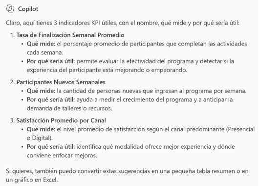

5. Ahora aplique el siguiente prompt:
``` 
   Cual seria la formula del KPI Tasa de crecimiento semanal de inscritos.
``` 

6. Observe la respuesta de Copilot (imagen referencial):

   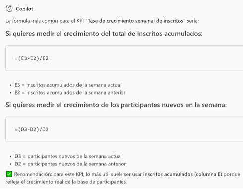

7. Aplica el siguiente prompt:
``` 
   Añade ese KPI como una nueva columna al final de la tabla.
``` 

   Se debe poder apreciar la columna agregada a la tabla de datos, revisa si todo esta conforme y haz clic en **Listo** (imagen referencial):

   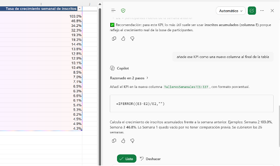

8. Repita los pasos previos si desea agregar los otros KPIs recomendados por Copilot.

**Prompt sugerido:**
``` 
Añade las columnas correspondientes a los 3 KPIs que recomendaste previamente.
``` 
Resultado referencial:

  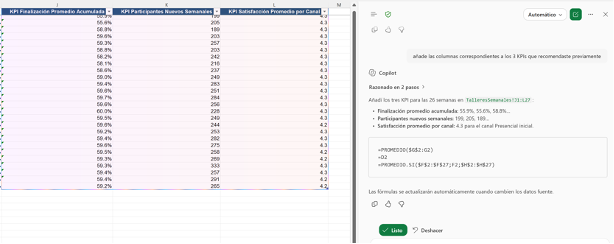

### Ejercicio 2: Análisis de datos

**Objetivo:** Usar Copilot para Excel, para realizar consultas variadas de análisis desde nivel básico hasta avanzado.

**Instrucciones:**

1. Abre **Excel**.

2. Abre el libro **Indicadores_Participacion_Educacion_Financiera_BancoEstado.xlsx**.

3. Abre el panel de Copilot. Aplica el siguiente prompt para un análisis simple:
``` 
   Dame un resumen general de los datos del archivo, indicando cuántas filas hay y qué representa cada columna.
``` 

4. Observa la respuesta devuelta por Copilot, debe ser similar a lo siguiente (imagen referencial):

   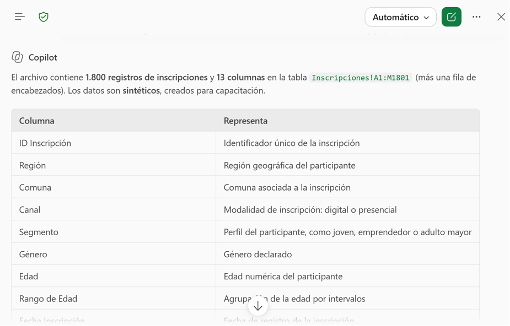

5. Aplica ahora el siguiente prompt:
``` 
   Indica cuántos participantes se inscribieron por cada Región.
``` 

6. Observa el resultado entregado por Copilot, debe ser similar al siguiente (imagen referencial):

   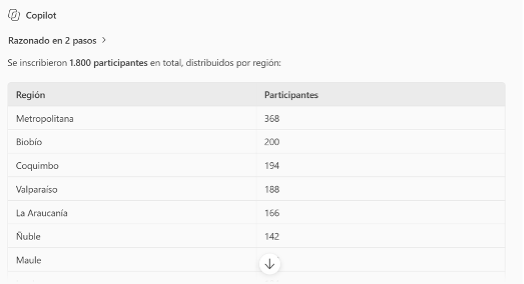

7. Si deseas saber cómo Copilot llegó a ese resultado puedes expandir la sección **"Razonado en x pasos"** (imagen referencial).

   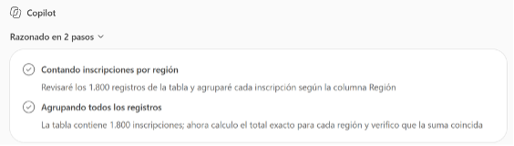

8. Si desea puede insertar los datos de la tabla con el siguiente prompt:

``` 
   Inserta ese resultado en una hoja nueva.
``` 

Podrías ver este resultado (imagen referencial):

   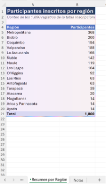

9. En el panel de Copilot se debe ver el resumen de lo que se ha realizado, en la parte inferior se tiene un botón para confirmar lo creado y otro para deshacerlo. Haz clic en **Listo**.

   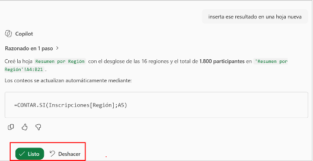

10. Retorna a la hoja **Inscripciones**. Puedes ahora aplicar los siguientes prompts y ver su resultado:
``` 
Muestra el total de inscritos por Canal (Presencial vs Digital).
``` 
    
   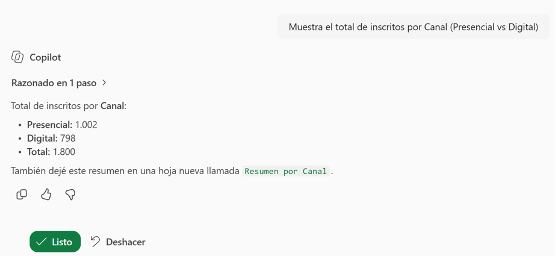

**Nota:** Dependiendo de la consulta y resultado, Copilot puede proactivamente crear una hoja nueva con  los resultados.

11. Retorna a la hoja **Inscripciones**. Prueba ahora el siguiente prompt:
``` 
Cuántos inscritos corresponden a cada Segmento (Adulto Mayor, Joven, Emprendedor).
``` 

 **Nota:** Si deseas puedes agregar la tabla resultante en una hoja nueva.

12. Retorna a **Inscripciones**. Para un análisis de nivel intermedio, aplica ahora el siguiente prompt:
``` 
Agrupa los inscritos por Rango de Edad (18-25, 26-40, 41-60, 61+), y calcula la tasa de finalización para cada grupo.
``` 

Puedes obtener un resultado como el siguiente (imagen referencial):

   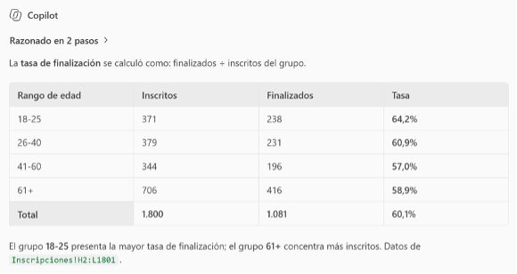

13. Aplica ahora el siguiente prompt:
``` 
    Muestra la satisfacción promedio por Región.
``` 
14. Puedes ahora aplicar los siguientes prompts y ver su resultado en cada caso.

#### Prompt 1: Desde la hoja Inscripciones
``` 
Identifica el medio de difusión más utilizado para la inscripción y la cantidad de veces que aparece. Preséntalo como un gráfico de barras horizontales, ordenado de mayor a menor cantidad, con una paleta de colores distinta para cada barra. Agrega el título "Medios de difusión más efectivos" y muestra el valor al final de cada barra.
``` 
**Resultado referencial:**

   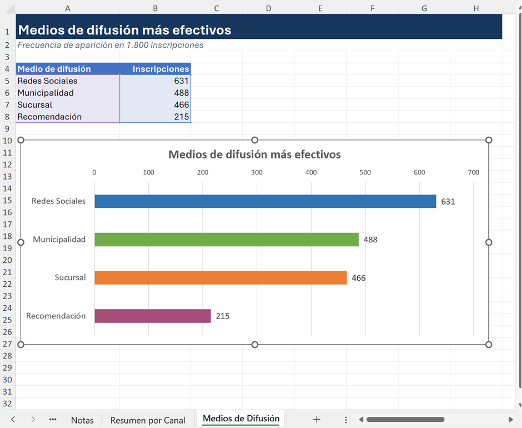

#### Prompt 2: Desde la hoja Inscripciones
``` 
Muestra el total de inscritos por mes usando la columna Fecha Inscripción. Preséntalo como un gráfico de líneas con marcadores en cada punto, con el mes en el eje horizontal y el total de inscritos en el eje vertical.

Usa un solo color azul institucional para la línea, agrega el título "Evolución mensual de inscripciones" y muestra las etiquetas de dato sobre cada punto.
``` 

Resultado referencial:

   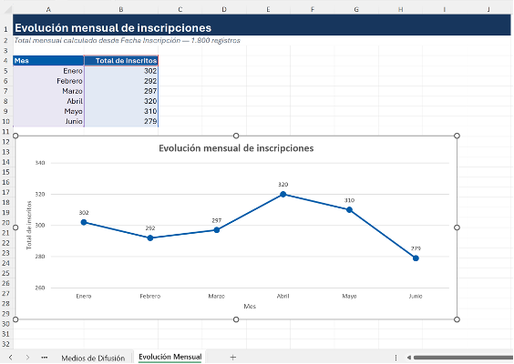

#### Prompt 3: Desde la hoja Inscripciones
``` 
Calcula la correlación entre Edad y Satisfacción para ver si la edad influye en la valoración del programa.
``` 

#### Prompt 4: Desde la hoja Inscripciones
``` 
Genera una tabla comparando hombres vs mujeres en número de inscritos y satisfacción promedio.
``` 

15. Para un análisis de nivel avanzado, aplica el siguiente prompt desde la hoja **Inscripciones**:
``` 
    Identifica patrones de participación por Segmento: ¿qué Canal prefieren los segmentos Adulto Mayor, Joven y Emprendedor? Importante: cambia los nombres de los segmentos acorde a los datos que tenga. Preséntalo como un gráfico de columnas agrupadas, con el Segmento en el eje horizontal y una columna por cada Canal (Presencial y Digital) en colores contrastantes (por ejemplo, azul y verde). Agrega leyenda, título "Preferencia de canal por segmento" y etiquetas de dato.
``` 

**Resultado referencial:**

   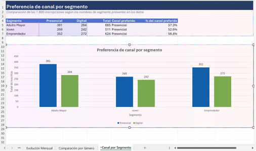

16. Puedes ahora aplicar los siguientes prompts y ver su resultado (si deseas creas una hoja adicional por cada resultado o según corresponda).

#### Prompt 1: Desde la hoja Inscripciones
``` 
 Analiza si existe estacionalidad en las inscripciones, mostrando los meses con más y menos inscritos. Preséntalo como un gráfico de columnas con el mes en el eje horizontal, resaltando en color naranja la columna del mes con más inscritos y en color gris la del mes con menos inscritos; el resto de las columnas en azul claro. Agrega el título "Estacionalidad de inscripciones" y las etiquetas de dato en la parte superior de cada barra.
``` 
#### Prompt 2: Desde la hoja Inscripciones
``` 
 Realiza un análisis de cohortes simple: agrupa a los inscritos por mes de inscripción y calcula qué porcentaje de cada cohorte alcanzó el estado Finalizado.
``` 
#### Prompt 3: Desde la hoja Inscripciones
``` 
Calcula un índice de efectividad por comuna, relacionando el número de inscritos con la tasa de finalización, para identificar las comunas con mejor desempeño relativo. Muestra solo el Top 10 de comunas como un gráfico de barras horizontales ordenado de mayor a menor índice, con un degradado de color de azul oscuro (mejor desempeño) a azul claro (menor desempeño dentro del Top 10). Agrega el título "Top 10 comunas por índice de efectividad".
``` 
> **Nota:** Es posible que Copilot consulte cómo deseas calcular el índice de efectividad por comuna. Si te hace la consulta, selecciona **Indice 50/50 normalizado** y **Enviar**.

   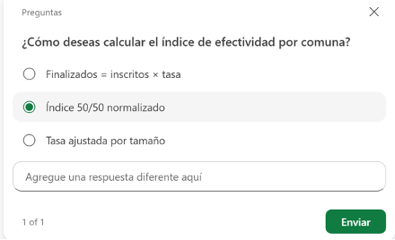

Se podrá observar un resultado como el siguiente:

   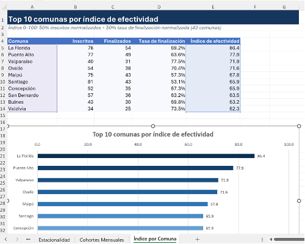

17. Guarda y cierra el libro.

---

# Práctica 3: Generación de una minuta con apoyo de Copilot

**Duración:** 10 minutos

## Descripción General

En este laboratorio, aprenderás a utilizar Microsoft 365 Copilot en Outlook para generar correos de resumen y accionables luego de una reunion.

## Objetivos de Aprendizaje

Al completar este laboratorio, serás capaz de:

- Elaborar correos de resumen apoyándose de Microsoft Outlook Copilot.

## Prerrequisitos

### Conocimientos Requeridos

- Conocimiento básico de Microsoft Outlook (envío, respuesta, organización de carpetas).
- Familiaridad con conceptos de gestión de correo electrónico (reglas, banderas, categorías).

## Instrucciones Paso a Paso

### Ejercicio 3: Creación de minuta mas detallada

**Objetivo:** Usar Copilot para crear un resumen mas detallado después de una reunion.

**Instrucciones:**

1. Abre **Outlook**.

2. Abre la barra lateral de **Copilot**.

3. Escribe y aplica el siguiente prompt:

```
Actúa como un asistente ejecutivo experto en documentación profesional.
 A partir del contenido de esta reunión `/BUSCAR REUNION` (transcripción, chat, audio y archivos compartidos), genera una **MINUTA DE REUNIÓN** en español, clara, profesional y orientada a la acción.

 Sigue **EXACTAMENTE** esta estructura y formato:

**1. ENCABEZADO**
- Título de la reunión
- Fecha
- Hora de inicio y fin
- Modalidad (Presencial / Teams / Híbrida)
- Organizador
- Responsable de la minuta

**2. PARTICIPANTES**

- Asistentes
- Invitados
- Ausentes

**3. OBJETIVO DE LA REUNIÓN**

Redacta un párrafo breve (máximo 3 líneas) que explique el propósito principal de la reunión.

**4. AGENDA / TEMAS TRATADOS**

Enumera los temas abordados durante la reunión en formato de lista numerada.

**5. RESUMEN POR TEMA**

 Para cada tema de la agenda:

 - Resume lo discutido en lenguaje claro.
 - No transcribas literalmente.
 - Enfócate en hechos relevantes, acuerdos y puntos clave.

**6. DECISIONES TOMADAS**

Presenta las decisiones en una tabla con las siguientes columnas:

- N°
- Decisión
- Responsable
- Fecha (si aplica)


 Si alguna decisión no tiene responsable o fecha clara, indica **"Por definir"**.

**7. ACCIONES / PENDIENTES**

Lista todas las acciones acordadas en una tabla con:
- Acción (verbo + qué hacer)
- Responsable
- Fecha límite

 **8. ACUERDOS ADICIONALES**

 Incluye lineamientos, compromisos generales o reglas acordadas que no sean tareas específicas.

**9. PRÓXIMA REUNIÓN**

Indica:

 - Fecha
 - Hora
 - Objetivo preliminar

Si no se definió, indica **"Por definir"**.

 **10. CIERRE**

- Hora de cierre
- Observaciones finales (si las hubiera)

 **REGLAS IMPORTANTES:**

- Usa un tono profesional y neutro.
- Sé conciso pero completo.
- No inventes información.
- Si algo no fue mencionado explícitamente, indica **"No definido"** o **"No mencionado"**.
- Prioriza decisiones y acciones sobre opiniones.
- Usa tablas donde se indique.
```


4. Haz clic en el botón inferior **"Copiar respuesta"**.

5. Crea un nuevo correo. Pega la respuesta en el cuerpo del correo. Selecciona el icono flotante de Copilot (con apariencia de globo azul). En las opciones que aparecen, selecciona **Obtener asesoramiento**.

    
    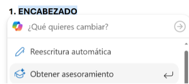

6. Esto hará que la IA analice el contenido del correo en aspectos como el *Tono*, *Perspectiva del lector*, *Claridad* y *Prioridades de mejora*.
Al final, Copilot puede plantear una serie de acciones. Si aparece la opción para aplicar las mejoras, selecciónala. Si no, escribe tú mismo un prompt para que aplique las mejoras.

    Imagen de resultado referencial:

   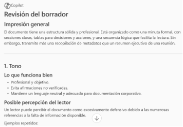

   **Imagen referencial para aplicación de mejoras:**


   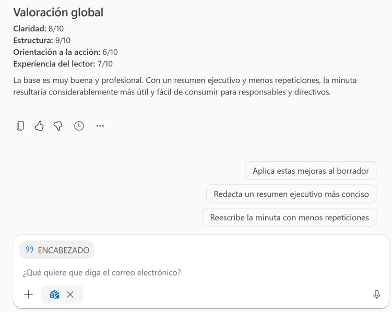

   Verifica que las mejoras fueron aplicadas. Como es un correo de ejemplo, puedes descartarlo al terminar.

